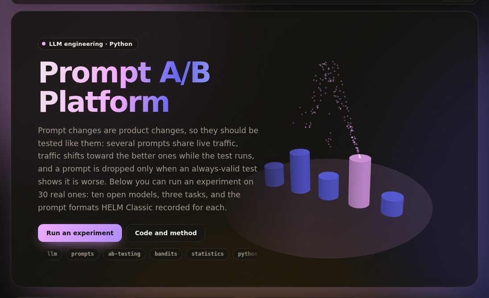

# prompt-ab-platform

[](https://umer-78.github.io/prompt-ab-platform/)

**Live demo:** https://umer-78.github.io/prompt-ab-platform/ (run a prompt experiment in your browser, Thompson sampling or an even split)

A/B/n testing for prompts on live traffic:

- Prompt versions are identified by a hash of their text.
- Traffic is allocated equally (uniform) or adaptively (Thompson sampling).
- An always-valid test drops losing prompts while the experiment runs.
- An HTTP API assigns each request its prompt and collects its score.

It was measured on real recorded answers: HELM Classic's prompt ablations, where ten open models answered the same questions under up to six prompt formats.

## Results

`python -m promptab bench`: 30 experiments (10 models × 3 tasks), each replayed 20 times over 20,000 requests. Once an experiment ends, the prompt it chose serves the rest of the requests.

**How much the prompt matters.** The table compares the best format with HELM's default format, for the same model on the same questions.

| Task | Experiments | Best beats default by 2+ points | Median gain | Largest gain |
|---|---|---|---|---|
| imdb (sentiment) | 10 | 2 | 0.1 | 15.9 |
| civil_comments (toxicity) | 10 | 6 | 2.5 | 63.8 |
| natural_qa (F1) | 10 | 2 | 0.1 | 2.6 |

- The largest gain is GPT-J 6B on civil_comments. It goes from 12.4% with HELM's `Passage:/Answer:` labels to 76.2% with `Input:/Output:`.
- The `<input>/<output>` tag format scores near zero for most models because answers come back as `Positive</output>`, which the exact-match scorer rejects. A format change that breaks answer parsing is exactly what an experiment should catch quickly.

**Running the experiment.** "Shortfall" is the score lost compared with serving the best prompt all along, per 1,000 requests. For a 0/1 score, that is wrong answers.

| Strategy | Chose a prompt within 1 point of the best | Decided before the horizon | Median requests to decide | Shortfall per 1,000 requests |
|---|---|---|---|---|
| keep the default (no experiment) | 56.7% | — | — | 51.6 |
| uniform A/B/n | 99.0% | 30.3% | 1,800 | 12.0 |
| Thompson sampling | 99.8% | 0.0% | — | 3.5 |

- Thompson sampling loses about a third as much as a uniform split because it moves traffic to the better prompts early.
- The cost is that it never gathers enough data on the weaker prompts to drop them, so it doesn't finish with a single proven winner.
- Uniform allocation does finish. It isolated a winner in 30% of runs; in most of the rest, the top formats were tied within what 20,000 requests can separate.
- Use uniform allocation when you need the answer, and Thompson when the traffic matters more than the answer.

**Identical variants (A/A).** Every variant was replaced by the default's recorded answers, with tolerance 0, so any drop is a false alarm.

| Allocation | Runs with a false drop | 95% interval |
|---|---|---|
| uniform | 8/600 (1.3%) | 0.7%–2.6% |
| Thompson | 1/600 (0.2%) | 0.0%–0.9% |

Both stay under the 5% bound. Full tables are in `results/bench.md` and `results/summary.json`.

**Limits.**

- These are 2022-era models, and the formats are small wording changes.
- The questions are benchmark items drawn uniformly, and each score is known exactly. Live feedback is noisier and arrives later, which slows every strategy.

## How it works

- **Prompts.** A variant is a `$placeholder` template. Its version is the first 10 hex digits of its SHA-256, so results name exactly the text that ran.
- **Allocation.** Each request gets one of the variants still in the running.
  - `uniform` gives equal shares.
  - `thompson` draws from each variant's Beta posterior and serves the highest draw.
  - Assignments are drawn in batches of `check_every` (50) from the state at the last check.
- **Dropping.** A variant is dropped once the test finds it worse than another variant by more than `tolerance` (1 point).
  - The test is a one-sided mixture likelihood ratio (Johari et al., *Peeking at A/B Tests*, 2017), checked every 50 scores for as long as the experiment runs.
  - Bonferroni across the ordered pairs keeps the chance of ever dropping a variant on a difference that isn't there under α = 5%.
- **Ending.** The experiment is decided when one variant is left. At `max_requests` it ends with the best of the survivors. Either way, that prompt serves from then on.

## Use

```bash
pip install -e '.[dev]'
python -m promptab serve examples/experiments.yaml
```

```bash
curl localhost:8000/experiments/review-sentiment/assign
# {"variant": "expert", "version": "134905eb0a", "template": "I am an expert AI assistant ... Passage: $text\nSentiment:"}
curl -X POST localhost:8000/experiments/review-sentiment/score -d '{"variant": "expert", "score": 1}'
curl localhost:8000/experiments/review-sentiment      # scores per variant, drops, winner
```

Replay one experiment from the recorded answers:

```bash
python -m promptab replay gpt-j-6b/civil_comments
#   request    250: dropped html: -64.2 points vs input_output
#   request    300: dropped default: -59.5 points vs input_output
#   request    350: dropped expert: -53.9 points vs input_output
#   request    350: dropped i_o: -54.5 points vs input_output
#   request    350: decided: input_output
```

Rebuild the live demo's data (each prompt's score distribution per experiment) with `python -m promptab.demo`.

HELM's public results are downloaded on first use into `~/.cache/promptab` (about 10 MB); nothing is committed.

## Layout

- `promptab/experiment.py`: prompts, allocation, the always-valid test and dropping.
- `promptab/server.py`: the HTTP API and YAML config (standard library only).
- `promptab/replay.py`: replays against HELM's recorded answers, and the bench.
- `promptab/data.py`: the prompt-ablation runs.
